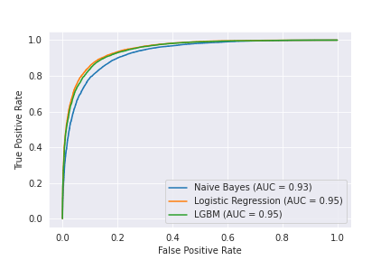

# Sentiment Analysis With IMDB Dataset [[1]](#References)
Project made with the objective of studying text classification, using approaches with different NLP techniques

[The dataset of the project can be found here!](https://ai.stanford.edu/~amaas/data/sentiment/)

-    Download data:
  `cd data/`
  `bash download_data.sh`

 **Dataset description **

> "This is a dataset for binary sentiment classification containing substantially more data than previous benchmark datasets. We provide a set of 25,000 highly polar movie reviews for training, and 25,000 for testing. There is additional unlabeled data for use as well. Raw text and already processed bag of words formats are provided."

## Text preprocessing
First of all we converted the '.txt' files to labeled DataFrames.
We also made some transformations in the texts, like removing some markings that can confuse the models and lemmatize all the verbs to normalize the texts.
After that, we saved the DataFrames of the pre-processed texts in '.csv' files.

*We did not remove the stopwords and punctuations here for testing reasons, but it was noted that all models were achieved a better score by removing both. So this was done on the other notebooks before training the models.*

## 1.1. Models with TF-IDF Vectorizer

We used the technique of [Term Frequency Inverse Document Frequency (TF-IDF)](https://scikit-learn.org/stable/modules/generated/sklearn.feature_extraction.text.TfidfVectorizer.html) for feature extraction of the texts, and after that we fit three types of classification models: Naive Bayes (MultinomialNB), Logistic Regression and LightGBM.

|Model| Test Accuracy|
|--|--|
|Naive Bayes|0.84784|
|Logistic Regression|0.88028|
|LightGBM|0.87512|

## 1.2. LSTM

We created a neural network using the Long Short-Term Memory (LSTM) architecture with the PyTorch framework

|Model| Test Accuracy|
|--|--|
|LSTM neural network|0.83840|

## 1.3. BERT Fine-Tuning

Bidirectional Encoder Representations from Transformers (BERT) [[2]](#References) is one of the most efficient architectures for different NLP tasks, being used even on Google's search engines. Here we use a pre-trained model for classification, and Fine-tuned it for our review classification task.

We used the PyTorch version of the neural network, provided by the  [Huggingface Transformers](https://huggingface.co/transformers/).

|Model| Test Accuracy|
|--|--|
|BERT|0.88556|

## References
[1] Andrew L. Maas, Raymond E. Daly, Peter T. Pham, Dan Huang, Andrew Y. Ng, and Christopher Potts. (2011). [Learning Word Vectors for Sentiment Analysis](https://ai.stanford.edu/~amaas/papers/wvSent_acl2011.pdf). The 49th Annual Meeting of the Association for Computational Linguistics (ACL 2011).

[2] [BERT: Pre-training of Deep Bidirectional Transformers for Language Understanding](https://arxiv.org/abs/1810.04805)
